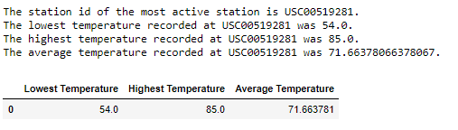
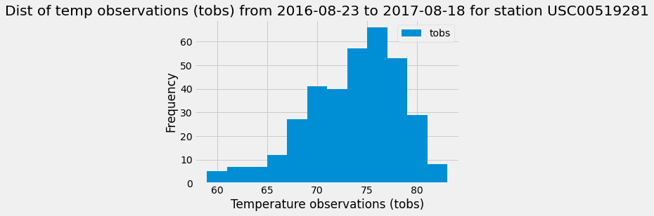
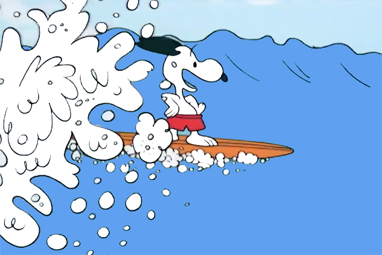

# Surf's UP

Congratulations! You've decided to treat yourself to a long holiday vacation in Honolulu, Hawaii! To help with your trip planning, you need to do some climate analysis on the area. You will be saying Mahalo once your have done all your planning!  

### Precipitation Analysis
 
 Data has been collect for a number of year, however we will only want to explore the latest year.

 The last update to the file was created on Auguest 23, 2017.  
 Our precipitation analysis will be from August 23 2016 until August 23, 2017

April, July and December are the rainiest times in Hawaii.

Overall, 2021 records were reviewed for the analysis.  
The overall average rainfall for Hawaii is 0.18 inches.
The Max is 6.7 inches of rain.   

### Station Analysis

There are nine weather stations on Oahu, the most active is USC00519281 which is located in Waihee.

Below you will see the Frequency of the temperature observations for the past year.

- - -

## There's An App for that!

Want more information, go over to our Hawaii Climate app!

You will be able to review data for precipitation, routes and stations.  

Aloha, and enjoy your vacation!  Mahalo.

